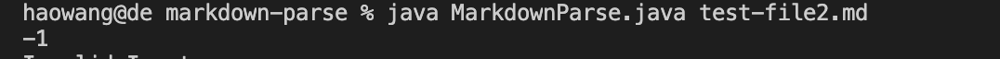

# CSE15L Lab Report Week4
## First Code Changes
**Code Changes**

**Link to the Github page**

[link on github](https://github.com/haowang0716/markdown-parse/commit/f71a682551939396ecd1a6743f6049f601c86daf)

**Symptom**

**After Debugging**

In the lab, we tried to make one of the test files invalid and see the output. At first, the program will print the same number(-1) infinitely. We realized that since there is not an if statement to exit the while loop, the program will print the wrong index infinitely. So we add an if statement to break out of the loop immediately. But this code is still problematic and you will see the further change we made in "Third Code Change".  

## Second Code Changes

**Code Changes**

**Link to the Github page**

[link on github](https://github.com/haowang0716/markdown-parse/commit/e681117f442080a60ef531a4cfcdae0b4e0755c1)

**Symptom**

**After Debugging**

When I wrote two JUnit(and another incomplete one)tests to check the output of the program with the first and the third test file, it will show six errors. After dicsussion with the tutor and the groups, we realized that we should also import the packages so it will run successfully. After adding the packages, I got three OK tests. 

## Third Code Changes
**Code Changes**

**Link to the Github page**

[link on github](https://github.com/haowang0716/markdown-parse/commit/e681117f442080a60ef531a4cfcdae0b4e0755c1?diff=split)

**Symptom**

**After Debugging**

We realized that when the name of the link is invalid, it should not still print the link. After debugging, we realized that we should not break out of the for loop, which leads to the program to print the link, so we let the program throw an expection when it encounters the invalid link name. 

